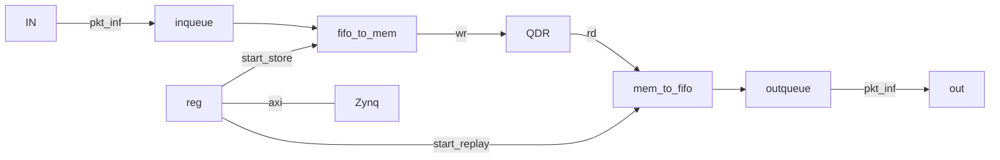

# dflow_packet_generator
packet generator for dflow experiment

## Content
    .
    ├── README.md
    ├── src
    │   ├── dflow_generator_core.v
    │   ├── dflow_generator.v
    │   ├── fallthrough_small_fifo_v2.v
    │   ├── fifo_to_mem.v
    │   ├── inqueue.v
    │   ├── mem_to_fifo.v
    │   ├── outqueue.v
    │   └── small_fifo_v3.v
    └── testbench
        ├── inqueue_test.v
        └── outqueue_test.v

## DataFlow

To be continued!